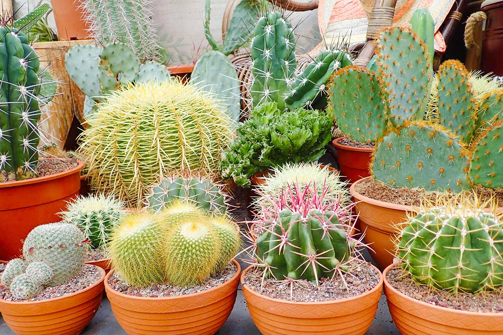

# 🌿 Plant Care Tracker

<p align="center">
  
</p>

<p align="center">
  <strong>A calm, data-driven Streamlit app for keeping your plants alive, healthy, and visible.</strong>
</p>

<p align="center">
  
  
  
</p>

## ✨ What it does

Plant Care Tracker is a Streamlit dashboard for tracking the daily life of your plants. It stores data in CSV files, makes care schedules visible, and adds a little joy to plant maintenance with growth logs, progress photos, and symptom-based diagnosis.

## 🌱 Features

- 🪴 Add plants with type, location, sunlight needs, care intervals, and a cover photo
- 💧 Record watering, fertilizing, repotting, and pruning
- ⏰ See what is past due and what is coming up next
- 📈 Log growth measurements over time and compare plants with a line chart
- 📷 Save progress photos to document change over time
- 🍂 Get seasonal care reminders based on plant type and CSV-backed seasonal rules
- 🩺 Diagnose common plant problems from symptoms and suggested fixes
- 🔎 Search plants by name or location
- 📋 Browse all plants in one table

## 🖼️ Gallery

<table>
  <tr>
    <td align="center">
      <br>
      <sub>Cover photo</sub>
    </td>
    <td align="center">
      <br>
      <sub>Progress photo 1</sub>
    </td>
    <td align="center">
      <br>
      <sub>Progress photo 2</sub>
    </td>
  </tr>
</table>

## 🧭 App Pages

- `Add Plant` - create a plant profile and upload a cover image
- `Record Care` - log completed care and recalculate the next due date
- `Due For Care` - review overdue and upcoming tasks
- `Search Plants` - find plants quickly by name or location
- `All Plants` - view the full plant table
- `Growth Tracker` - store measurements for each plant
- `Growth Chart` - compare height and width trends over time
- `Progress Photos` - upload and browse photo history
- `Seasonal Reminders` - adjust care guidance for the current season
- `Diagnose Problems` - match symptoms to likely issues and recommendations

## 🗂️ Data Files

This app is powered by CSV files under `data/`:

- `plants.csv` - plant profiles and care settings
- `care_log.csv` - completed care events
- `due_log.csv` - next due dates for each activity
- `growth_measurements.csv` - height, width, leaf count, and notes
- `plant_photos.csv` - progress photo history
- `plant_problem_rules.csv` - symptom-to-problem diagnosis rules
- `seasonal_rules.csv` - seasonal care reminders and schedule multipliers by plant type

Uploaded images are stored in `data/uploads/`.

## 🚀 Getting Started

1. Install dependencies:

```bash
pip install -r requirements.txt
```

2. Run the app:

```bash
streamlit run main.py
```

3. Open the local Streamlit URL in your browser.

## 🧠 How It Works

- The app uses Streamlit for the UI and Pandas for data handling.
- Plant, care, growth, photo, diagnosis, and seasonal data are persisted as CSV files.
- Seasonal logic adjusts watering and fertilizing schedules based on plant type, season, and `data/seasonal_rules.csv`.
- Diagnosis rules are data-driven, so the symptom library can grow without rewriting the UI.

## 🔧 Notes

- The app expects a sample plant dataset in `data/`.
- If you add a new plant, it will automatically get care schedule entries.
- The current rule set is intentionally lightweight and easy to extend.

---

<p align="center">Made for people who want their plants to thrive, not just survive.</p>
